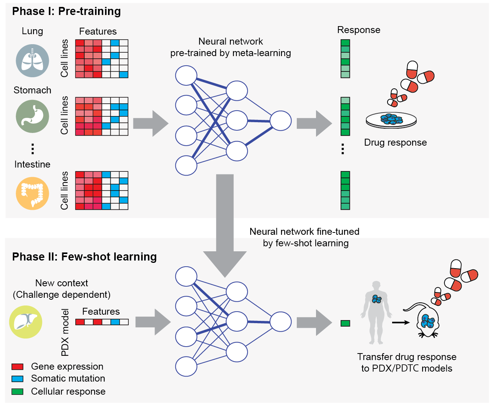

### Bianca Kirsh | 1003756893 | Winter 2023

### MBP 1413H - Biomedical Applications of Artificial Intelligence
# *Full Reproducibility of Computational Research: Myth or Reality?* 

This project aims to reproduce the study [Few-shot learning creates predictive models of drug response that translate from high-throughput screens to individual patients (*Nat Cancer* 2021)](https://www.nature.com/articles/s43018-020-00169-2#data-availability), which describes a transfer learning algorithm for drug response predictions in cancer.

The authors' original codebase can be accessed [here](https://github.com/idekerlab/TCRP/) and the refactored codebase can be accessed [here](https://github.com/shfong/tcrp-reproduce).

This codebase contains the instructions, data, and code required to reproduce and replicate the figures from **Challenge 1** of the original study, which investigated the transfer of CRISPR (1a) and drug (1b) response models for prediction in the context of a new tissue.

## Table of Contents
1. [Directory Structure](#1-directory-structure)
2. [Datasets Documentation](#2-datasets-documentation)
3. [Step-by-Step Running Guide](#3-step-by-step-running-guide)

     3.1. [Overview](#31-overview)
     
     3.2. [Installation Instructions](#32-installation-instructions)
     
     3.3. [Running Instructions](#33-running-instructions)
     
     3.4. [Performace Assessment](#34-performance-assessment)
     
4. [Sample Run](#4-sample-run)

## 1. Directory Structure

```
.
├── tcrp_model
│   ├── data
|   |   ├── input
|   |   ├── output
|   |   |   ├── cell_line_lists
|   |   |   ├── drug_feature
|   |   |   └── runs
|   |   ├── fewshot_data
|   |   └── results
|   ├── pipelines
│   │   ├── data_preparation
│   │   ├── model
│   │   └── baselines
│   ├── model_comparisons
|   └── sample
├── requirements.txt
└── README.md

```

## 2. Datasets Documentation
All datasets required to reproduce this study are contained within the *./tcrp_model/data/input.* The exact link to each input file is provided as a commented-out line of code in the preprocessing Jupyter Notebooks in *./tcrp_model/pipelines/data_preparation.*

| Dataset | Source | Description | Version |
| ----------- | ----------- | ----------- | ----------- |
CRISPR screening | DepMap | High-throughput CRISPR screening of ~17,700 gene disruptions across 341 cancer cell lines (Project Achilles) | Achilles Avana Public 17Q4 v2 |[link](https://depmap.org/portal/download/all/?releasename=Achilles+Avana+Public+17Q4+v2) |
Drug sensitivity | GDSC1000 | High-throughput drug screening of 255 anti-cancer drugs across 1,001 cancer cell lines| GDSC1 |[link](https://www.cancerrxgene.org/downloads/bulk_download)|
Expression features|CCLE|Gene somatic mutation and mRNA expression levels |Release 6.0

## 3. Step-by-Step Running Guide

### 3.1. Overview

The machine-learning task is to use molecular features of each cell line to predict its growth response to CRISPR gene disruptions (a) and target drug perturbations (b). Features for learning are gene somatic mutations and mRNA expression levels for each cell line. Sample labels are the growth response of a cell line to the CRISPR gene disruption (a) or target drug (b) of interest as measured by CERES-corrected gene disruption scores and AUCs, respectively.

The TCRP model consists of a neural network trained in two phases. The first phase is a pre-training phase, which uses Model Agnostic Meta-Learning (MAML) to train a general predictive model on extensive data generated in large cell-based screens. The second phase is a fine-tuning phase, which uses few-shot learning to fine-tune the pre-trained model and transfer the predictions to a new context.

For each gene disruption (a) and drug (b) learning problem, one tissue is held out for the few-shot phase and the remaining tissues are used in the training phase. In the few-shot phase, *k* cell lines from the held-out tissue (n = 1) are randomly selected as few-shot samples to fine tune the model, with k = [0, …, 10]. This selection is repeated 20 times and the final prediction performances reported by the authors corresponds to the average and s.d. over all replicates. The remaining cell lines are used as testing data.

The baseline models are  trained by conventional learning approaches, including Random Forest (RF), Neural Network (NN), K-Nearest Neighbors (KNN), and Linear Regression (LR).



### 3.2. Installation Instructions

This project requires **Python** with **GPU** support (3.8.5, miniconda 4.9.2). It can be run in your local machine or on an HPC cluster, and runtimes will vary depending on this choice.

To install all modules and packages required by this project, execute the following line of code:

```pip install -U --no-cache-dir -r requirements.txt```

### 3.3. Running Instructions

#### Step 1: Data Preprocessing

Task-specific features and labels can be generated using the jupyter notebook *./tcrp_model/pipelines/data_preparation*.

- For Challenge 1a, use the notebook */process_crispr_ko_cell_line.ipynb*
- For Challenge 1a, use the notebook */process_sanger_drug_cell_line.ipynb*

If you choose to use your own input datasets, change the pointer variables in the beginning of the notebooks to update file names/locations.

#### Step 2: Complete Run

A complete of the pipeline consists of both pre-training (phase I) and fine-tuning (phase II) the TCRP model, as well as generating all 4 baseline models. This can be done using the jupyter notebook *./tcrp_model/pipelines/complete_run.ipynb.*

More detailed instructions on how to run each step of the pipeline are provided in the notebook. I added the option to specify select cell lines, tissues, and/or drugs for which you would like to build the TCRP model. This was not an option previously enabled by the original version of Ma et al., but may be useful when running only a small subset of tasks is possible or necessary.

### 3.4. Performance Assessment

Plots comparing the performance of the TCRP model relative to the 4 baselines can be generated using the jupyter notebook *./tcrp_model/model_comparisons/plot_results.ipynb.* Once again, details and additional commentary are provided inside the notebook.

## 4. Sample Run

The *./tcrp_model/sample/* folder contains sample input files required for a complete run. It also contains the scripts necessary for that run and the output that would have been generated after executing them.

This folder follows a similar directory structure as the main project, and its purpose is to simulate  Please use option ‘-tissue_list’ to specify the file to use.
Please also prepare a ‘task list’ file to store the detailed information of each sub-task in the pre-training phase. It is a Python dictionary stored in a pickle file. The key of that dictionary is the name of the sub-task, which should be the same as the feature and label file. For example, if the sub-task is called ‘lung’, then the corresponding feature and label files should be ‘lung_Sorafenib_feature.npy’ and ‘large_Sorafenib_label.npy’, respectively. 

## Acknowledgments

I thank Emily So for her help and guidance in this project. Emily had previsously attempted to reproduce this study as part of a Student-Led Reproducibility Challenge and provided invaluable insights that made this work possible. 


## References

1. Ma J, Fong SH, Luo Y., Bakkenist CJ, Shen JP, Mourragui S, Wessels LFA, Hafner M, Sharan R, Peng J, Ideker T.  Few-shot learning creates predictive models of drug response that translate from high-throughput screens to individual patients. Nat Cancer. 2021 Feb;2(2):233-244. doi: 10.1038/s43018-020-00169-2. Epub 2021 Jan 25. PMID: 34223192 [Pubmed](https://pubmed.ncbi.nlm.nih.gov/34223192/)

2. Emily So , Grace Yu , Benjamin Haibe-Kains (2023) Reusability Report:   Few-shot learning creates predictive models of drug response that translate from   high-throughput screens to individual patients [Source Code]. https://doi.org/10.0260/CO.7288809.v2
